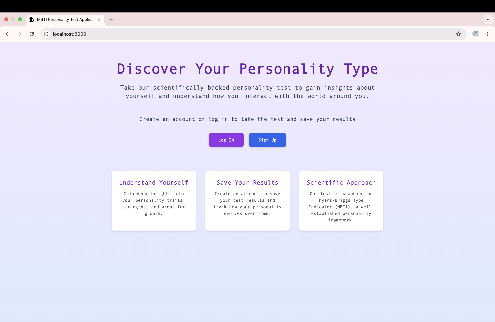
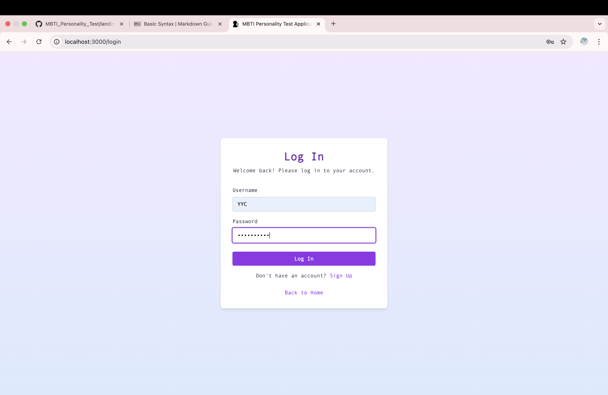
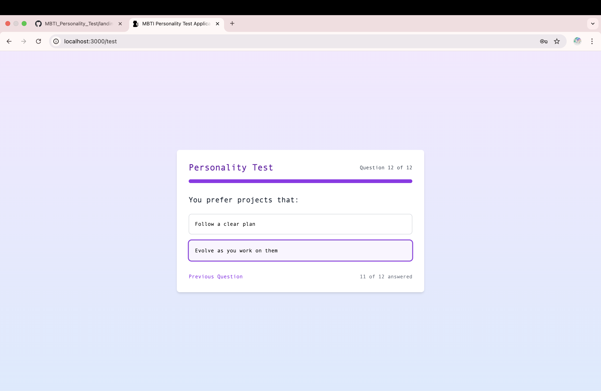
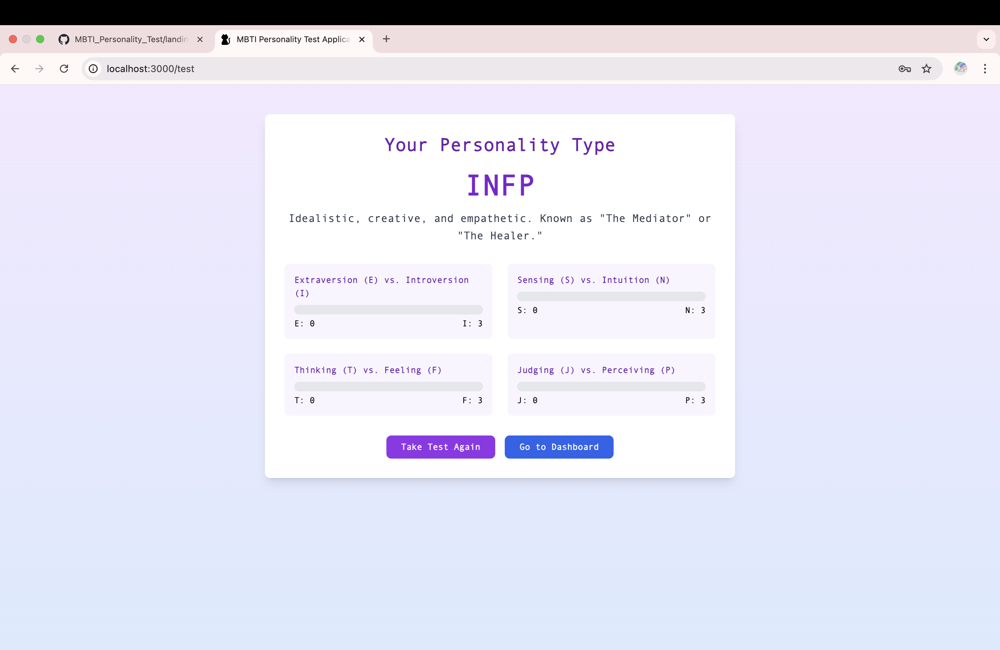
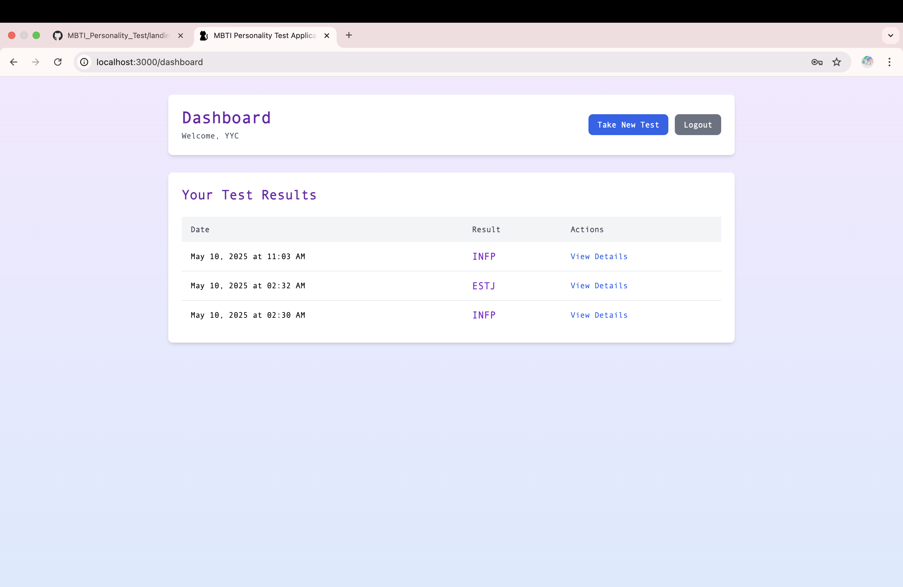
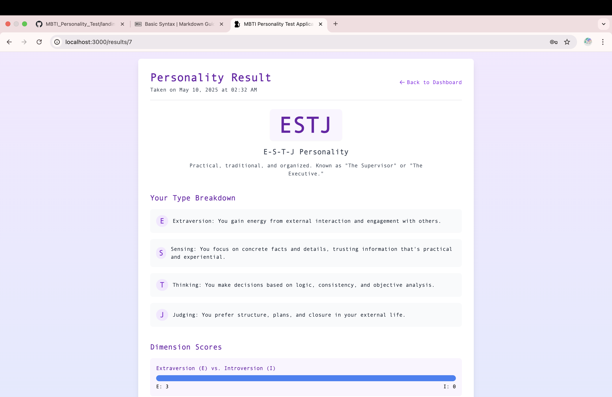
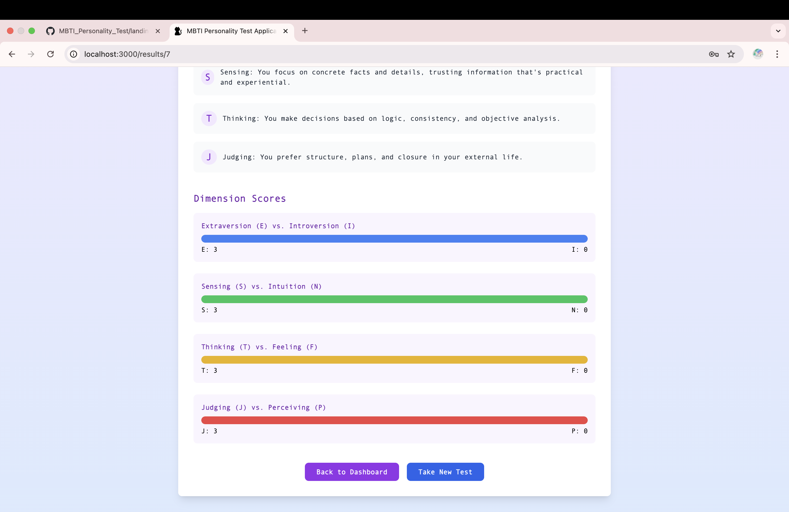

# MBTI Personality Test Application

A full-stack web application for personality testing with user authentication and result storage.

### Landing Page



### Login Page



### Test Page




### Dashboard Page



### Test Result Page




### 🚀 Deployment & Troubleshooting

This project is optimized for deployment on Vercel. During development, we resolved two critical architectural challenges:

1. Subdirectory Build Path
   Because the source code is located in the /frontend directory, Vite's default build behavior would place files in frontend/dist. However, Vercel expects build artifacts at the project root.

Fix: The build script was updated to use --outDir ../dist, which "pushes" the production files from the subdirectory to the root level for Vercel to detect.

2. Single Page Application (SPA) Routing
   A common issue in SPAs is the "Refresh 404 Error". While React handles navigation internally, refreshing the browser on a sub-page (like /dashboard) causes the browser to request a file that doesn't exist on the server.

Solution: We implemented a vercel.json file with a Catch-all Rewrite. This instructs the server to redirect all requests to index.html, allowing react-router-dom to maintain control of the routing.

## Features

- User authentication (register, login, logout)
- Personality test based on MBTI framework
- Result storage in MySQL database
- User dashboard to view test history
- Responsive design with Tailwind CSS

## Prerequisites

- Node.js (>= 14.x)
- MySQL Server
- npm or yarn

## Installation

1. Make sure you are in the Source_Code directory
2. Install dependencies:
   ```
   npm install
   ```
3. Create a `.env` file in the root directory with the following variables:

   ```
   # JWT Secret (used for authentication)
   JWT_SECRET=your_jwt_secret_here

   # Database Configuration
   DB_HOST=localhost
   DB_USER=your_mysql_user
   DB_PASSWORD=your_mysql_password
   DB_NAME=mbti_db

   # Server Configuration
   PORT=3000
   ```

4. Create a MySQL database named `mbti_db` (or whatever you specified in your .env file)

## Running the Application

### Development Mode

```
npm run dev
```

### Production Mode

```
npm run build
npm start
```

## Database Schema

The application uses two main tables:

### users

- id (INT, PRIMARY KEY)
- username (VARCHAR)
- email (VARCHAR)
- password (VARCHAR, hashed)
- created_at (TIMESTAMP)

### test_results

- id (INT, PRIMARY KEY)
- user_id (INT, FOREIGN KEY to users.id)
- result_type (VARCHAR) - The MBTI personality type (e.g., "INTJ")
- score (JSON) - Detailed scores for each dimension
- created_at (TIMESTAMP)

## API Endpoints

### Authentication

- POST /api/auth/register - Register a new user
- POST /api/auth/login - Log in a user
- GET /api/auth/profile - Get the current user's profile (protected)

### Personality Test

- GET /api/personality/results - Get all test results for the current user (protected)
- POST /api/personality/results - Save a new test result (protected)
- GET /api/personality/results/:id - Get a specific test result (protected)

## License

MIT
